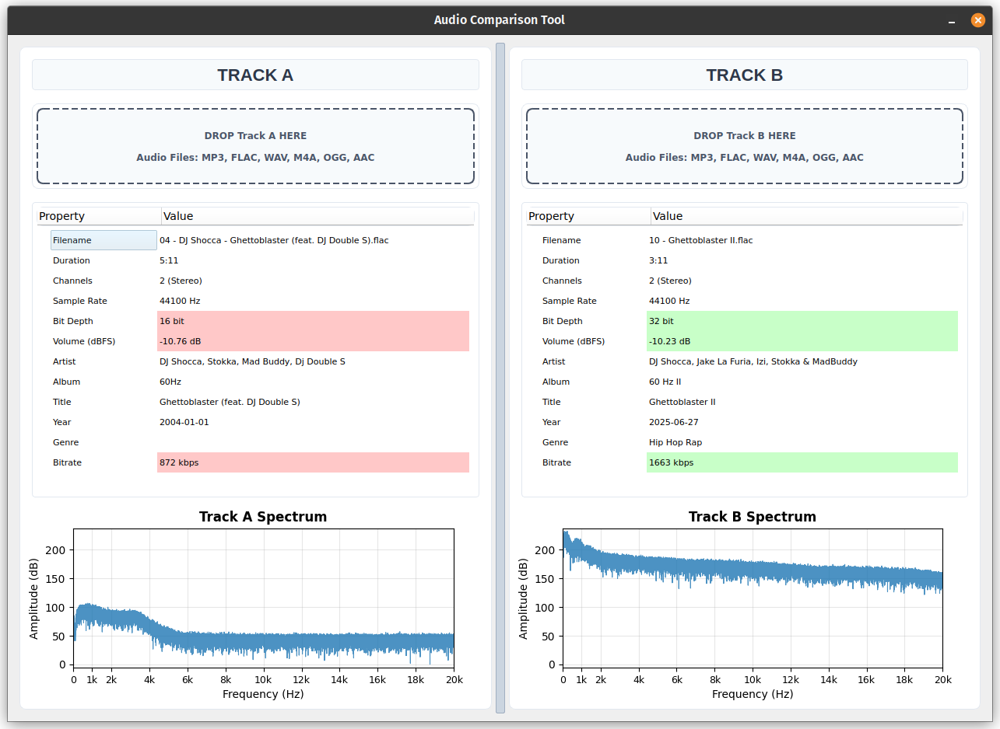

# Audio Compare

An application for comparing two audio tracks side-by-side, their metadata, bitrate, and frequency spectrum.



## Features

- **Drag & Drop Interface**: Simply drag audio files onto the interface
- **Metadata Comparison**: Compare bitrate, sample rate, channels, and more
- **Visual Highlighting**: Green/red highlighting shows which track has better properties
- **Synchronized Spectrum Analysis**: Normalized frequency spectrum plots for accurate comparison
- **Rich Metadata**: Artist, album, title, year, genre extraction from audio files
- **Professional UI**: Clean, modern interface with responsive design

## Supported Formats

- MP3
- FLAC
- WAV
- M4A
- OGG
- AAC

## Installation

```bash
pip install -r requirements.txt
```

## Usage

```bash
python main.py
```

## Features

### Metadata Comparison

- Properties are compared between tracks
- Green highlighting indicates better values
- Red highlighting indicates worse values

### Spectrum Analysis

- Normalized scales for accurate comparison
- High-resolution frequency analysis
- Windowed FFT for clean spectrum plots
- Synchronized amplitude ranges

### Comparison Logic

- **Higher is Better**: Bitrate, Sample Rate, Bit Depth
- **Volume Optimization**: Higher dBFS values (closer to 0) are better

## Dependencies

- PyQt5: GUI framework
- mutagen: Metadata extraction
- pydub: Audio file processing
- numpy: Numerical computations
- matplotlib: Spectrum plotting